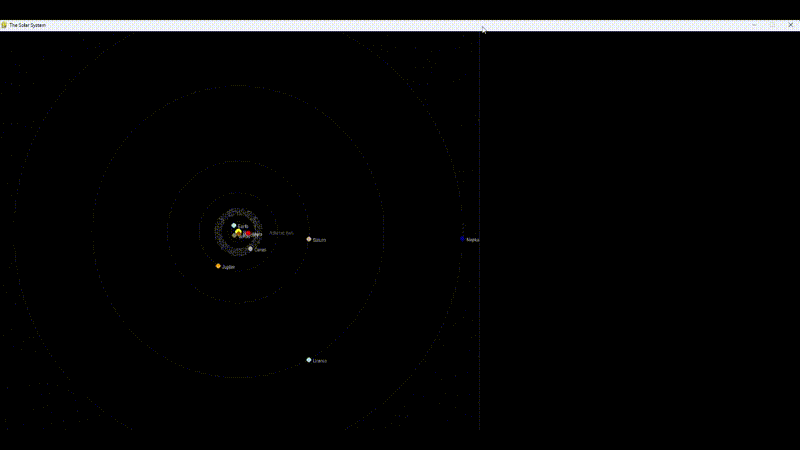
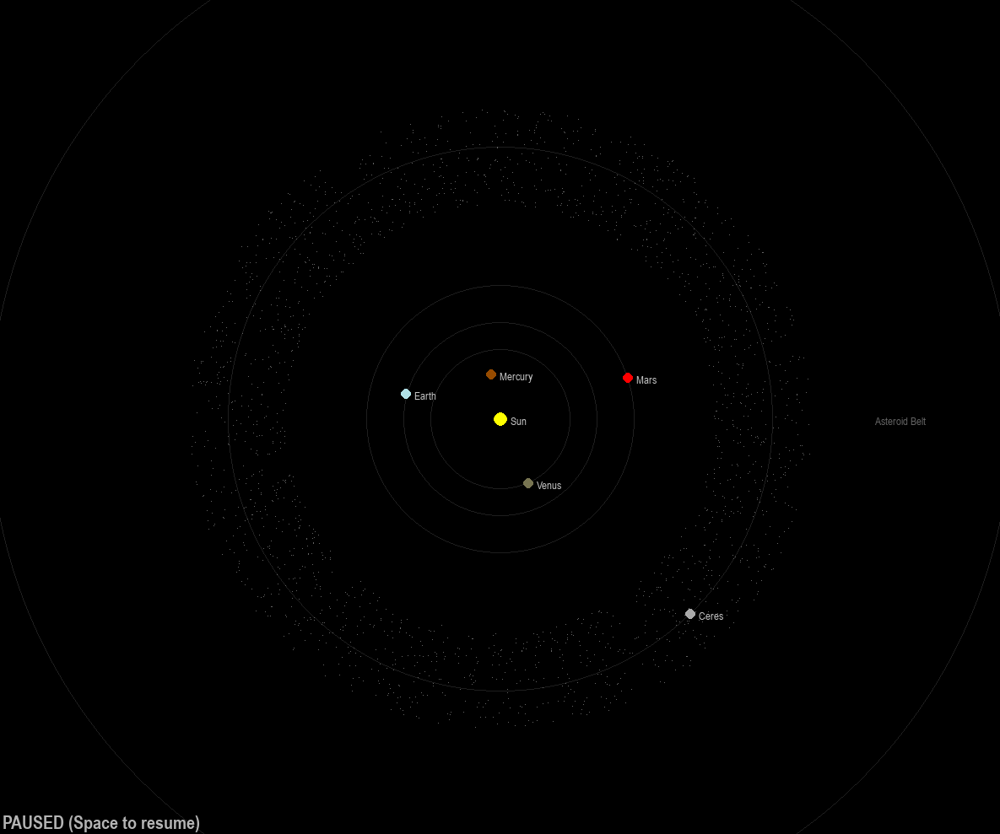
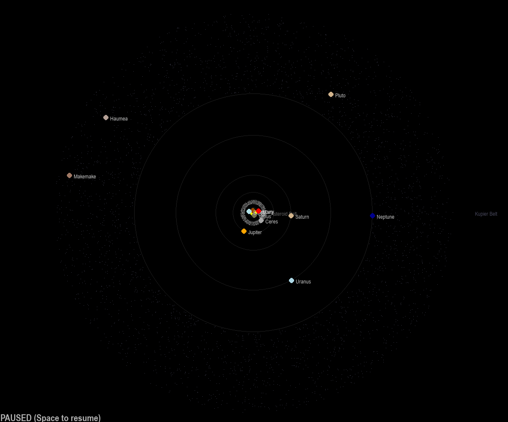
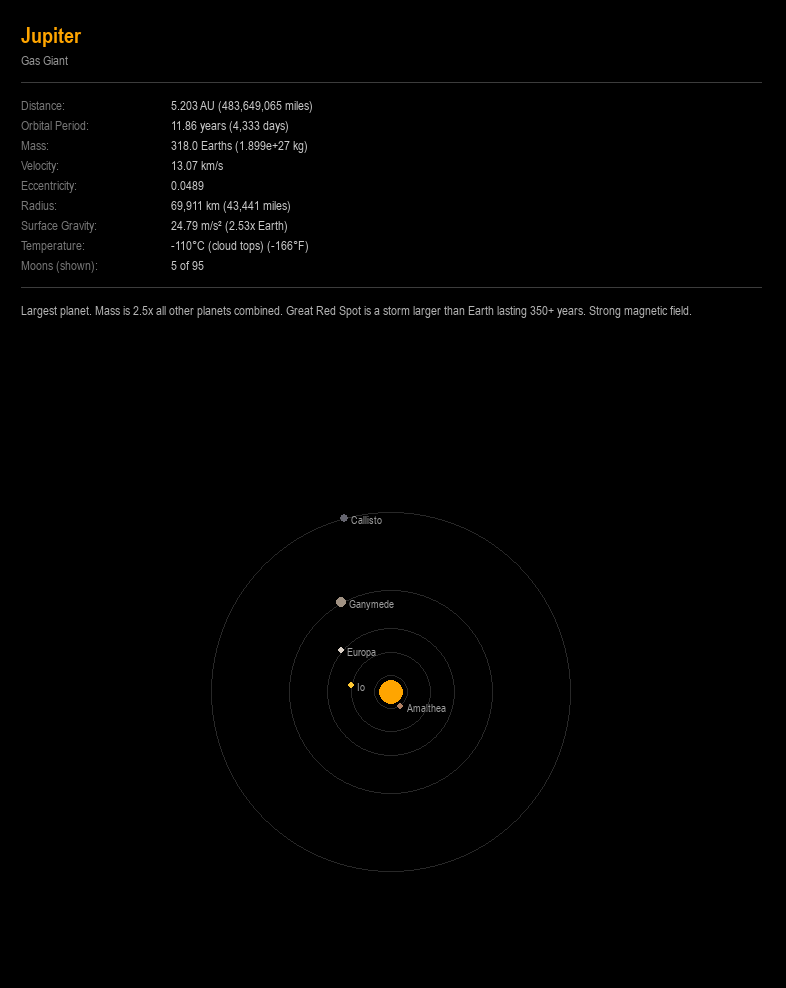
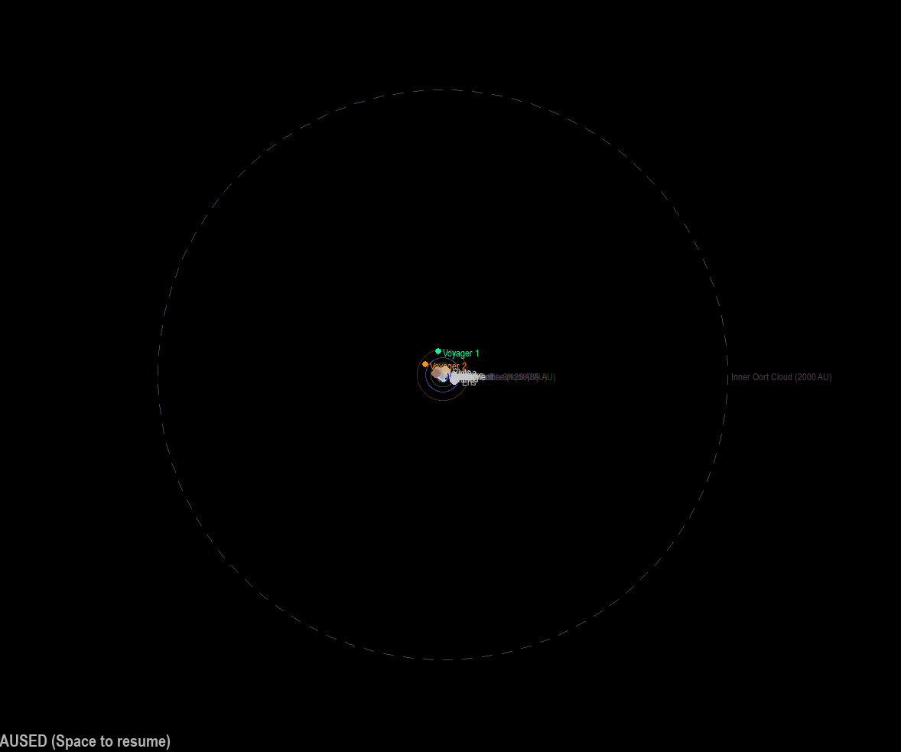

# The Solar System




A real-time interactive solar system simulator built with Pygame. Planets use live ephemeris data from JPL Horizons when available, with Newtonian gravity driving orbital mechanics. Includes dwarf planets, asteroid and Kuiper belts, heliosphere boundaries, Voyager probes, and a detailed info panel with moon visualizations.

## Features

- **Live orbital data** from NASA JPL Horizons API (fallback to Keplerian defaults)
- **N-body gravity** simulation with configurable timestep
- **14 bodies**: Sun, 8 planets, Ceres, Pluto, Haumea, Makemake, Eris
- **30+ moons** with animated orbital diagrams in the detail panel
- **Asteroid Belt & Kuiper Belt** rendered as particle fields
- **Oort Cloud** boundary marker at ~50,000 AU
- **Heliosphere boundaries**: Termination Shock, Heliopause, Bow Shock
- **Voyager 1 & 2** probes with 3D trajectory tracking
- **Interactive camera**: scroll to zoom, click any body to inspect
- **Detail panel** with physical data, descriptions, and unit conversions

## Screenshots & Video

| View | Preview |
|------|---------|
| Inner solar system |  |
| Outer solar system |  |
| Detail panel |  |
| Full zoom out (belts + boundaries) |  |

**Demo video:** [solar_system_demo.mp4](video/solar_system_demo.mp4)

## Controls

| Input | Action |
|-------|--------|
| Scroll wheel | Zoom in / out |
| Click a body | Select it (shows detail panel) |
| `0` | Deselect |
| `+` / `-` | Zoom moon diagram in detail panel |

## Requirements

```
python 3.8+
pygame
math
re
random
JPL_location
```

## Running

```bash
python SOLAR.py
```

The program will attempt to fetch live positions from JPL Horizons on startup. If the network is unavailable it falls back to default orbital positions silently.

## Project Structure

```
├── main.py              # Main simulation loop and all classes
├── JPL_location.py      # JPL Horizons API integration
├── README.md
├── screenshots/         # Put your screenshots here
│   ├── overview.png
│   ├── inner_planets.png
│   ├── outer_planets.png
│   ├── detail_panel.png
│   └── full_view.png
└── video/
    └── solar_system_demo.mp4
```


